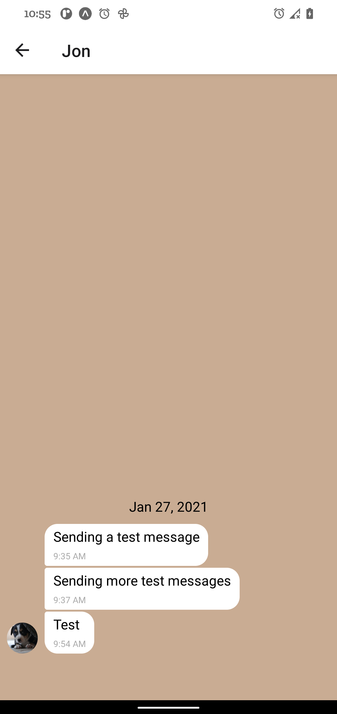
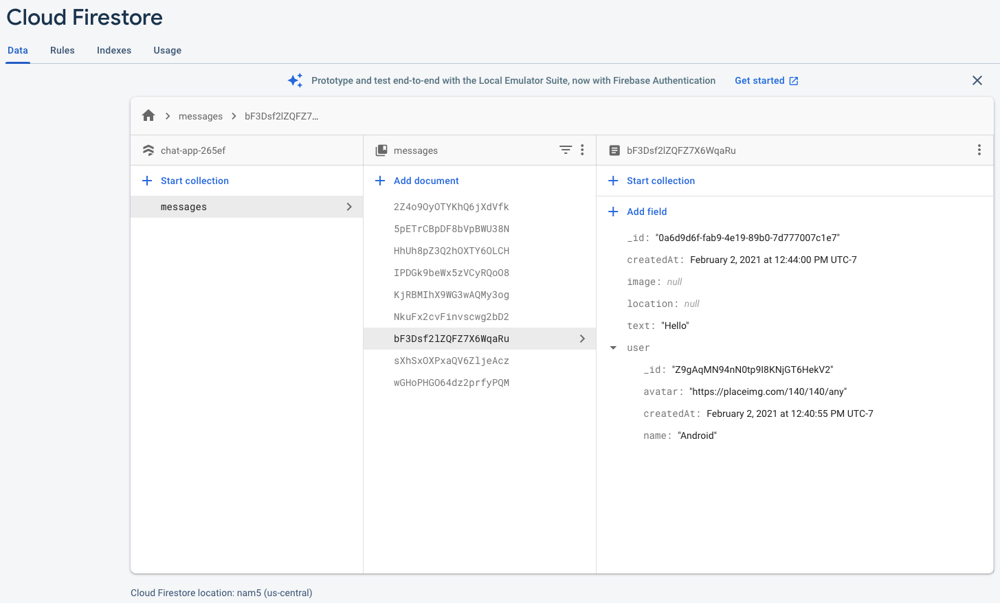
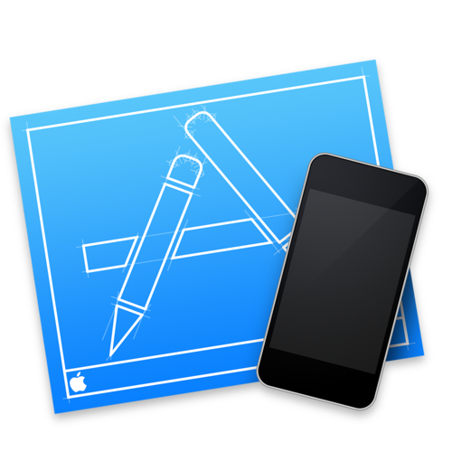
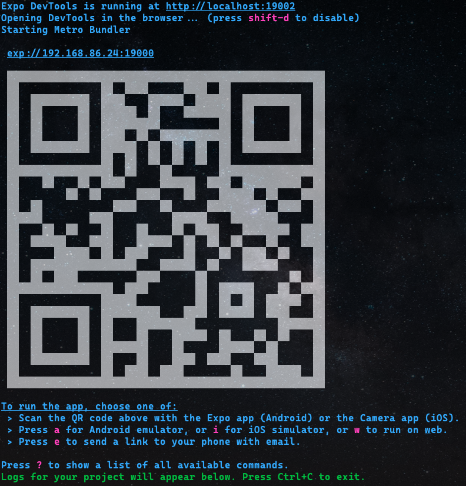
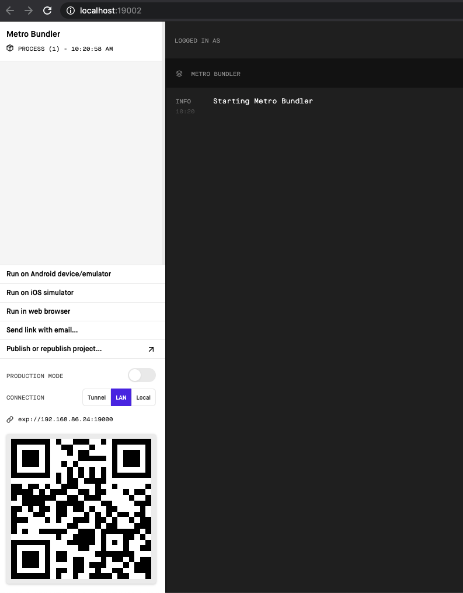
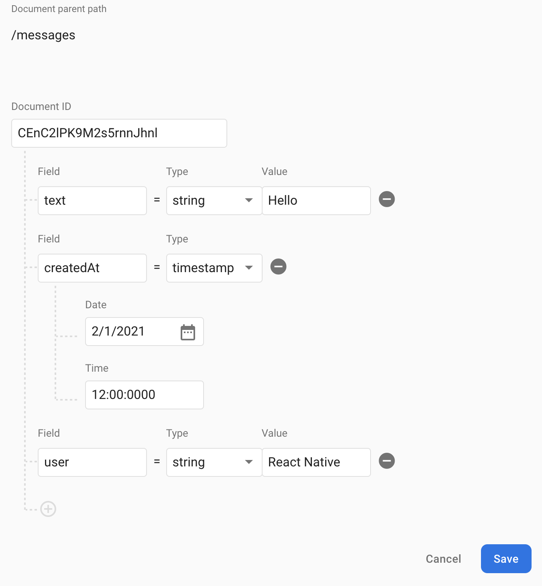
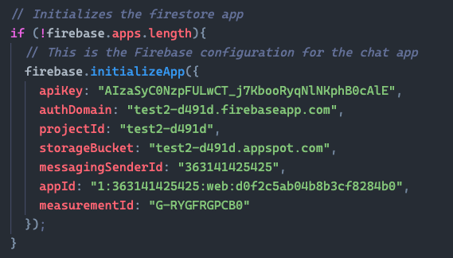

# Chat-App
A simple React Native application that uses Expo's gifted-chat and Google Firebase to create a real-time chat app for Android and iOS.
The app also includes the ability to view messages offline while disabling the input so no new messages can be sent.

<!--  -->

 

## App Features
* Users can enter their name and choose a background color for the Chat screen.
* The Chat screen will display the conversation as well as an input field and send button.
* Users will have the option to send images and location data.
* Message data is stored locally and online.

## Technical Info
* Written in React Native
* Developed using Expo
* Users are authenticated anonymously via Google Firebase authentication
* Users can send images from their device's media library
* Users can take a picture with the device camera and send it
* Message text and image data stored in Google Firestore Database
* The app can read and share the user's location data in a map view
* Chat interface and functionality created with the Gifted Chat library

# Install Expo
The Expo CLI is required to run the application.  Install it via the terminal using the following command:

`npm install -g expo-cli` **or** `yarn add global expo-cli`

For more information about installing Expo check the documentation [here](https://docs.expo.io/get-started/installation/).

You will also need to install the  *Expo Go* app on your mobile device.

## Expo Setup
You will need to create an Expo account if you have not done so already.  This can be done at the [Expo Sign-Up](https://expo.io/signup) page.  Once you've created an account, log in via your web browser and also in the *Expo Go* app on your mobile device.  You will also use these same credentials to log into the Expo CLI.

## Install Dependencies
After completing the Expo setup download or clone the repository, open it with VS Code or your editor of choice, and install all app dependencies.  Do this after navigating to the project's root folder via the terminal using either `npm install` **or** `yarn install`.

# Android Emulator Setup
Download and install [Android Studio](https://docs.expo.io/workflow/android-studio-emulator/?redirected).  You will be guided through the installation process.  **Be sure NOT to uncheck the option for "Android Virtual Device"** during installation.

After installation is complete, open Android Studio and select the "Configure" option.  From there, select SDK Manager --> Appearance and Behavior --> System Settings --> Android SDK.  Select the "SDK Tools" tab in the main window and make sure "Android SDK Build Tools" are installed.  If not, select "Android SDK Build Tools" and download the latest version by clicking the download symbol next to it.

** _**Note for MacOS and Linux users**_ ** You will need to add the location of the Android SDK to your PATH.  To do this, copy the path shown in the "Android SDK Location" field from the main window (above the SDK Tools tab) and add the following line to your ".bashrc" or ".bash_profile" file:

`export ANDROID_SDK=/Users/myuser/Library/Android/sdk`

*Be sure to replace "myuser" with your information.*

** **MacOS users only** ** You will also need to add platform tools to your ".bashrc" or ".bash_profile" file.  Do this by adding the following to the appropriate file:

`export PATH=/Users/myuser/Library/Android/sdk/platform-tools:$PATH`

*Again, be sure to replace "myuser" with your information.*

### Running Android Emulator
Close the SDK Manager and return to the main Android Studio window.  Select the "Configure" option again and choose "AVD Manager."  Click on "+ Create Virtual Device" and choose a device from the list.  Click "Next" and choose an Android version from the "Recommended" tab.  Click the "Download" link next to your version choice.  After the download is complete, in the next screen, name your device and click "Finish."  

Return to the AVD Manager and click the  icon to start the emulator.

You can find further instructions for Expo and Android Studio Emulator [here](https://docs.expo.io/workflow/android-studio-emulator/).

# iOS Simulator Setup
** **_A device that runs MacOS 10.15.4 or later is required to use Xcode/Simulator_** **

If you don't have it already, you will need to install  [Xcode](https://developer.apple.com/xcode/resources/). After launching Xcode navigate to "Preferences" (&#8984; ,) and select the "Components" tab.  From there, select a simulator of your choice to be installed.  You can launch the  Simulator by navigating to the main Xcode menu --> Open Developer Tool --> Simulator.

You can find further instructions for Expo and iOS Simulator [here](https://docs.expo.io/workflow/ios-simulator/).

# Launch Expo
Launch Expo using the terminal with `expo start` or `npm start`.

A QR code will be displayed in your terminal window along with instructions to press "a" for Android Emulator or "i" for iOS simulator.  A similar window will also open in your web browser.  Select either option or open the Expo Go app on your mobile device and scan the QR code after selecting the corresponding option.  

** _iPhone users will need to open the camera app and scan the QR code that way_. **

# Google Firebase Setup
Go to the [Google Firebase](https://firebase.google.com/) page and sign in using your Google credentials.  If you do not have a Google account you will need to create one before moving forward.

Click the "Go to Console" link (in the top-right corner) and then click "Create Project."  There are a few steps that ask for your information.

## Set Up Firebase Database
After you have created your project, select the "Build" option from the menu on the left of the screen.  From the same menu, select "Cloud Firestore" and then "Create Database."  Select the "Start in test mode" option and click "Next."  On the next screen, choose a location that is closest to you.

Now click "Start Collection" and input "messages" as the Collection ID.  In the next screen click on "Auto-ID" in the Document ID field to auto-assign an ID to all new messages.  If you use the code provided in this repository, you will need to use the same keys included in the messages object (text, createdAt, user).  See screenshot below.

## Firebase Authentication Setup
In order to utilize the app's ability to send and store messages, users will need to be authenticated.  Under the "Build" option select "Authentication."  Click "Get Started" to reveal the list of sign-in methods.  Enable "Anonymnous" at the bottom of the menu.

## Generating an API Key
An API key is needed to give the application access to the database.  Click the gear icon next to "Project Overview" in the menu on the left-hand side of the screen.  From there select "Project Settings" and "Create Web App" at the bottom of the General tab.  The Create Web App option will be an icon containing "</>."  Name your app and click "Register App" to finish.  From the following screen, copy everything from "apiKey: to messagingSenderId:"  appId: and measurementId: are not required.  Navigate to the Chat.js file in the components folder and replace the values with your own.  It should look something like this:

### Refer to the Launch Expo section above to run the app in Android Emulator, iOS Simulator, or on your mobile device

Happy coding! :zombie: